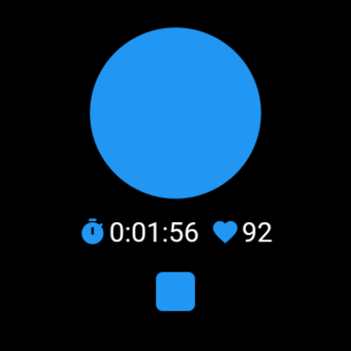
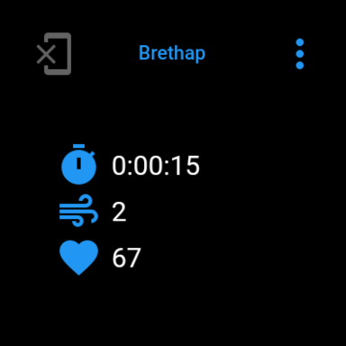
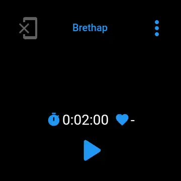
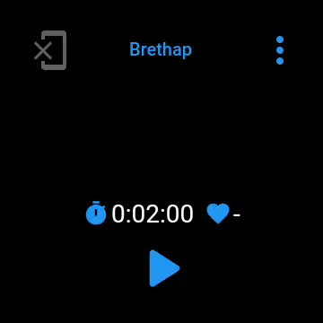
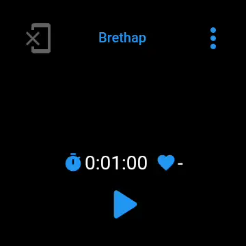

# Brethap Wear

Slimmed down version of [Brethap](https://github.com/jithware/brethap) for Wear OS.

## Screenshots

## Usage

### Running
* To start a session, press the Start button
* To end a session, let the timer expire or press the Stop button

### Presets
* To select a preset, press the menu button and select the desired preset

### Custom
* To select the custom preset, press the menu button and select Phone Preference. If you are not connected to the phone app, press the phone button to do so. The [Brethap](https://github.com/jithware/brethap) phone app must be installed on your phone and your watch setup with the [Wear OS App](https://support.google.com/wearos/answer/6056630).
* To change the custom preset on your watch, open the Brethap [Preferences](https://github.com/jithware/brethap#preferences) on your phone and modify the preference.

## Donate

Donate to the project's maintainer [@jithware](https://github.com/jithware)

 | 
