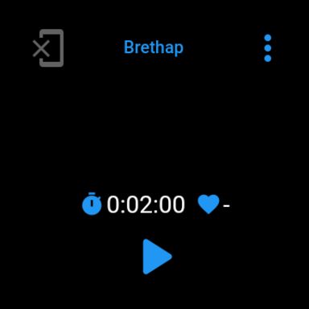

# Brethap Wear

Slimmed down version of [Brethap](https://github.com/jithware/brethap) for Wear OS.

## Screenshots

## Usage

### Running

*TODO*

## Donate

Donate to the project's maintainer [@jithware](https://github.com/jithware)

 | 
